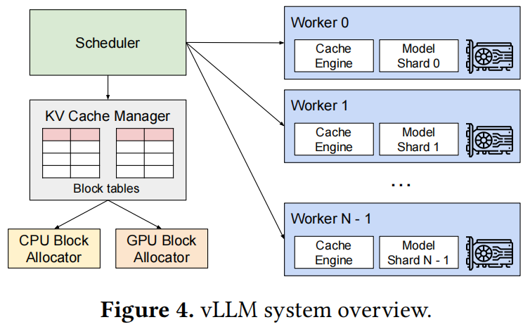
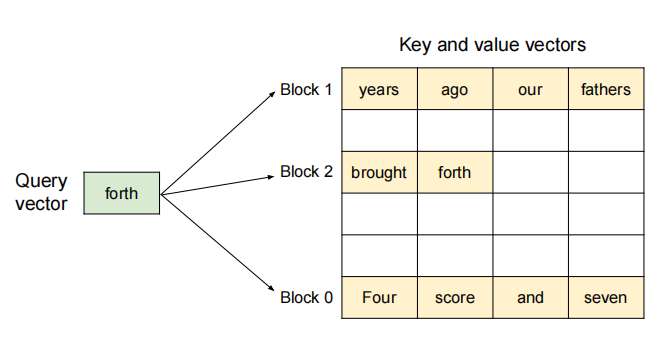
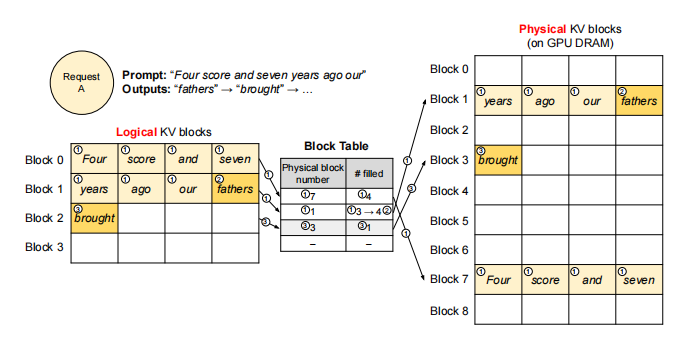
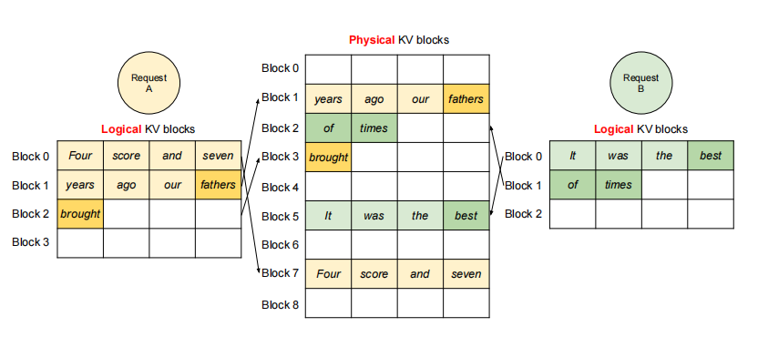
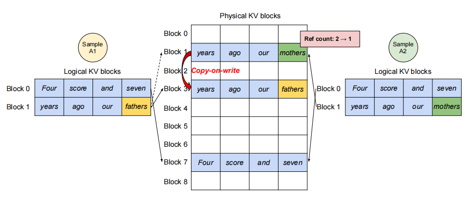

## 论文解读：Efficient Memory Management for Large Language Model Serving with PagedAttention
[论文原文](https://arxiv.org/abs/2309.06180)

### Abstract
为了提供LLM的高吞吐量服务，每次需要批量处理足够多的请求。然而现有系统面临**KV缓存内存不足**的挑战：每个请求的KV缓存内存占用巨大，且动态增减。当内存管理效率低下时，碎片化和冗余复制会造成显著的内存浪费，从而限制批处理规模。为解决这一问题，我们提出PagedAttention，这是一种受经典操作系统虚拟内存与分页技术启发的注意力算法。基于此，我们构建了vLLM这一LLM服务系统，其实现了：(1) KV缓存内存接近零浪费；(2) 支持请求内及跨请求的KV缓存灵活共享，进一步降低内存占用。评估表明，在相同延迟水平下，vLLM将主流LLM的吞吐量较FasterTransformer、Orca等最先进系统提升了2-4倍。当处理更长序列、更大模型及更复杂解码算法时，性能提升尤为显著。

### Introduction
当前LLM serving system主要面临：KV缓存的管理问题。通常做法是将一条request的KV cache存储在连续的内存空间内（大部分deep learning框架要求tensors在连续内存空间中存储）。KV cache和tensors的区别在于：
1. **KV Cache随模型生成新token，而动态增减**；
2. 其生命周期和长度无法提前预测。

因此，在两个方向上导致了内存使用的低效：

1. **内存的内外碎片**：为满足连续空间存储的要求，需要**预先分配一段连续的最大内存空间**（例如：2048 tokens），这会导致内部碎片（request的实际长度小于最大长度）；

    > 即使长度预知，预先分配也是低效的：在request的生命周期内，内存块为其保留；导致其他更短的request也无法使用当前空闲的内存块。
    
    另外，对于每个request，预分配不同长度的空间，会导致外部碎片。

2. **未实现内存共享的最大优化**：LLM通常采用advanced decoding算法（并行采样或束搜索），这些算法为每个request生成多个输出序列，可以部分共享KV Cache，但已有系统未考虑这一点。

PagedAttention的想法是什么呢？提出了页式虚拟内存机制。

将request的KV cache拆分为多个blocks：每个block包括固定数量tokens的attention keys和values。因此，KV Cache无需存储在连续内存空间。
> 联动OS的理念：将blocks当作页面；tokens当作字节；requests当作进程。
> 
> 这个设计通过使用更小尺寸的的blocks和按需分配，消除内部碎片；通过固定大小的blocks消除外部碎片。

### BackGrounds
#### 基于Transformer的LLM
LLM的任务是：对token序列$(x_1, x_2, ..., x_n)$的概率模型建模。采用**自回归分解**：将整个序列的联合概率，分解为条件概率的乘积：
$$
P(x)=P(x_1)\cdot P(x_2|x_1)\cdot\cdot\cdot P(x_n|x_1,...,x_{n-1}).
$$

Transformer模型是大规模概率建模的事实标准架构，其核心组件是**自注意力层（self-attention layer）**。处理输入隐藏状态序列$(x_1, ..., x_n)\in\mathbb{R}^{n\times d}$时，首先对每个位置$i$进行线性变换生成查询（query）、键（key）和值（value）向量：
$$
q_i=W_q x_i, k_i=W_k x_i, v_i=W_v x_i.
$$
随后，该层通过计算当前位置query向量与所有历史位置的key向量的点积，得到注意力分数$a_{ij}$：
$$
a_{ij}=\frac{\exp(\frac{q_i^{T}k_j}{\sqrt{d}})}{\sum_{t=1}^{i}\exp(\frac{q_i^{T}k_t}{\sqrt{d}})}, o_i=\sum_{j=1}^{i}a_{ij}v_j.
$$

#### LLM服务&自回归生成
经过训练后，大型语言模型（LLM）通常被部署为条件生成服务（例如自动补全API或聊天机器人）。向LLM服务发出的请求会提供一组input prompt tokens$(x_1,x_2,...,x_n)$，LLM服务则根据自回归分解公式，生成output tokens$(x_{n+1},x_{n+2},...,x_{n+T})$。将input prompt tokens与output tokens的组合称为序列（sequence）。

由于自回归分解公式的分解特性，LLM只能**逐个采样生成新token**，且每个新token的生成过程都依赖于该序列中所有先前的tokens——特别是它们的键（key）和值（value）向量。在这一顺序生成过程中，现有token的键值向量，通常会被缓存以供后续token生成使用，即KV缓存（KV cache）。需要注意的是，**某个token的KV缓存取决于其之前的所有token**，这意味着同一token出现在序列不同位置时，其KV缓存也会不同。

对于给定的一个request prompt，生成过程分为两个阶段：

1. prompt phase：以完整用户prompt$(x_1,x_2,...,x_n)$为输入，**计算首个新token的概率$P(x_{n+1}|x_1,...,x_n)$**。在此过程中，同时生成键向量$k_1,...,k_n$和值向量$v_1,...,v_n$。由于token$x_1,...,x_n$均为已知，该阶段可通过矩阵-矩阵乘法实现并行计算，因此能充分利用GPU的并行计算优势。
   
2. autoregressive generation phase：按顺序生成剩余新tokens。在第$t$次迭代时，模型接收单个token$x_{n+t}$作为输入，基于缓存的键向量$k_1,...,k_{n+t-1}$和值向量$v_1,...,v_{n+t-1}$，计算概率$P(x_{n+t+1}|x_1,...,x_{n+t})$，并生成新的键值向量$k_{n+t}$和$v_{n+t}$。该阶段在序列达到最大长度（用户指定或模型限制）或生成结束符<eos>时终止。**由于数据依赖性，不同迭代的计算无法并行化，且多采用效率较低的矩阵-向量乘法运算**，导致GPU计算资源利用率严重不足，形成内存瓶颈——这构成了单个请求延迟的主要来源。

#### LLM批处理
由于同一批次内的请求共享模型权重，权重加载的开销可被批量请求均摊——当批次规模足够大时，计算开销将完全覆盖权重传输成本。然而LLM 批处理面临两大挑战：

1. **请求的异步到达**特性。若采用简单批处理策略，要么让先到请求等待后续请求（导致排队延迟），要么推迟新请求直至当前批次完成（造成吞吐量下降）。
2. **请求的输入输出长度差异巨大**。若强行通过填充（padding）对齐序列长度，将导致GPU计算资源和内存的严重浪费。

> 为解决这些问题，学界提出了**细粒度批处理机制**（如蜂窝批处理和迭代级调度）。与传统请求级批处理不同，这些技术基于迭代维度运作：每完成一次迭代，系统便移除已处理完成的请求，并动态加入新请求。这使得**新请求仅需等待单个迭代周期即可被处理**，无需阻塞至整批请求完成。此外，借助专用GPU内核，这些技术彻底消除了序列填充需求。通过降低排队延迟与填充损耗，细粒度批处理机制能显著提升LLM服务的吞吐效率。

### Methods


#### PagedAttention
将每个序列的KV Cache分为若干个KV blocks，每个block包含：固定数量的键向量和值向量。将key block表示为：$K_j=(k_{(j-1)B+1},...,v_{jB})$；value block表示为：$V_j=(v_{(j-1)B+1},...,v_{jB})$.注意力计算公式变为：
$$
A_{ij}=\frac{\exp(\frac{q_{i}^{T}K_j}{\sqrt{d}})}{\sum_{t=1}^{\lceil \frac{i}{B}\rceil}\exp(\frac{q_{i}^{T}K_t}{\sqrt{d}})}, o_i=\sum_{j=1}^{\lceil \frac{i}{B}\rceil}V_jA_{ij}^T
$$
其中，$A_{ij}=(a_{i,(j-1)B+1},...,a_{i,jB})$是第$j$个KV block的注意力分数。

在注意力计算过程中，PagedAttention内核会动态识别、并分别获取不同的KV块。如图所示，键值向量分散存储在三个非连续物理内存块中（例如块0存储"Four score and seven"的键值向量）。

内核执行分阶段计算：

1. **query-key交互**：每一次计算中，内核将query token（"forth"）的query向量$q_i$，与一个block内的key向量$K_j$相乘，以计算注意力分数$A_{ij}$。
2. **value聚合**：将$A_{ij}$与当前块的$V_j$相乘，生成局部注意力输出$o_i$。

总结来说，PagedAttention算法允许KV blocks存储在非连续的物理内存空间，使得vLLM中能够采用更灵活的页内存管理。

#### KV Cache Manager
vLLM内存管理器的核心设计思想源于：操作系统的**虚拟内存**机制。操作系统将内存划分为固定大小的页（page），并将用户程序的逻辑页映射到物理页上——**连续的逻辑页可对应非连续的物理内存页，使得用户程序能以连续视角访问内存**。更重要的是，物理内存空间无需预先全量分配，操作系统可**按需动态分配物理页**。

vLLM将虚拟内存的思想应用于LLM服务的KV缓存管理：

1. 存储结构：
   * 通过PagedAttention将KV缓存组织为固定大小的**KV块**（类比虚拟内存中的页）；
   * 每个请求的KV缓存表示为从左到右填充的**逻辑KV块序列**，末块预留空位供未来生成使用。

2. 硬件资源管理：
   * GPU工作节点：块引擎（block engine）分配连续GPU显存，并划分为物理KV块；
   * CPU内存：同样分块以支持交换机制

3. 映射系统：
   * 块表（block table）：维护逻辑KV块与物理KV块的映射关系
   * 每个块表条目记录：
     * 逻辑块对应的物理块地址
     * 已填充位置数量

#### 使用PagedAttention和vLLM解码
通过以下示例，说明vLLM如何在单输入序列的解码过程中执行PagedAttention并管理内存：


1. prefill：与操作系统虚拟内存类似，vLLM无需预先为最大可能序列长度保留内存，而是仅分配prompt计算所需的KV块。
    * 7个prompt tokens被分配到2个逻辑KV块（块0和块1）；
    * 逻辑块映射到物理块7和1；
    * 使用常规自注意力算法，生成prompt的KV Cache和首个输出token；
    * 前4个tokens存入逻辑块0，后3个tokens存入逻辑块1（末位预留空位）。
2. 首次自回归解码
    * 基于物理块7和1执行PagedAttention生成新token；
    * 新生成的KV缓存存入逻辑块1预留槽；
    * 块表中#filled字段更新。
3. 二次解码
    * 当逻辑块1写满时，分配新逻辑块；
    * 从空闲池获取物理块3并建立映射；
    * 更新块表记录新增的逻辑-物理块对应关系。

全局来看，vLLM在每次解码迭代时执行以下关键操作：

1. 动态批处理构建：选择候选序列集合进行批处理；为新需求的逻辑KV块分配物理块。
2. 输入序列整合：将当前迭代内，所有输入tokens拼接为单一序列：提示阶段请求的所有tokens+生成阶段请求的最新token
3. 分页注意力执行：通过PagedAttention内核：访问以逻辑KV块形式存储的历史KV缓存；将新生成的KV缓存写入分配的物理KV块。

vLLM采用**动态物理块分配**机制：随着新token及其KV缓存的生成，系统持续为逻辑块分配新的物理块。其内存高效性体现在两个关键设计：

1. 紧凑的内存布局：
    * 严格遵循从左到右的填充顺序；
    * 仅当所有现存块写满时，才分配新物理块；
    * 将内存浪费严格限制在单个块容量内。
2. 弹性资源共享：
    * 请求完成生成后，立即释放其KV块，供其他请求复用；

    > 
    > 如图所示：两个序列的逻辑块，可映射到不同的物理块，实现GPU节点的内存共享。

#### vLLM在其他解码场景的应用
##### 并行采样（Parallel Sampling）
对于一个输入prompt，LLM生成多个输出采样。用户可从多个候选者中，选出最喜欢的输出。

并行采样场景中，**单个请求包含：共享相同输入prompt的多个输出样本**，这使得prompt的KV缓存也可被共享。借助PagedAttention和分页内存管理机制，vLLM能够轻松实现这种内存共享优化。共享机制的实现如下图：


1. prompt阶段：双输出样本共享相同的prompt，因此只保留一份prompt状态的拷贝；**两个序列的prompts对应逻辑块，映射至相同的物理块**。
   * 逻辑块映射：序列A1/A2的逻辑块0 → 物理块7；序列A1/A2的逻辑块1 → 物理块1
   * 物理块引用计数：物理块7和1的引用计数均为2
2. generation阶段：**写时复制机制（copy-on-write）**
   * 当样本A1需修改逻辑块1时：检测物理块1引用计数>1；分配新物理块3并复制原数据；物理块1引用计数降为1
   * 样本A2写入物理块1时：引用计数已为1，直接写入

vLLM的技术优势：

* 内存节省：多个输出共享prompt的KV缓存，显著减少长提示词场景的内存占用；
* 安全隔离：块级写时复制，确保多样本修改隔离性；
* 零冗余设计：仅末位逻辑块需写时复制，其余物理块完全共享。

##### 束搜索（Beam Search）

在机器翻译等LLM任务中，束搜索用于获取**最优k个输出**。通过束宽参数$k$，控制每一步保留的候选序列数，有效避免全量遍历样本空间的计算复杂度。其工作流程分为三步：

1. 候选扩展：对束内的每个候选序列，枚举词汇表$V$的所有可能续接tokens；
2. 概率评估：调用LLM计算$k\times |V|$个候选序列各自的生成概率（$|V|$为词汇表大小）
3. 择优保留：筛选概率最高的$k$个序列，进入下一轮迭代。

与并行解码不同，束搜索实现了更深层次的KV块共享机制：不止共享prompt对应block，**不同候选序列也共享对应blocks，共享机制随着解码过程动态迭代**。

1. 动态共享拓扑：
   * 所有候选序列，强制共享首个block（prompt block 0）
   * 候选序列3从第2块开始分叉；候选序列0-2共享前3块，在第四块分叉
   * 淘汰候选序列（0和3）时自动释放其逻辑块
2. 智能内存管理：
   * 引用计数归零的物理块即时释放；
   * 为新候选序列动态分配物理块（块9-12）


##### 共享前缀

在LLM应用中，用户通常需要提供**包含instructions和example inputs/outputs**的**系统提示词（system prompt）**，这些内容会与实际任务input拼接，形成完整prompt。此类共享prefix可通过提示词工程进一步微调，以提升下游任务的准确率。vLLM的实现方式如下：

1. **预缓存机制**：预先将共享prefix的KV缓存，存入专用物理块（类比OS对共享库的内存管理）；
2. 动态映射：含有共享prefix的用户请求，可直接将逻辑块映射到已缓存的物理块（末位块标记为copy-on-write）；
3. 计算优化：prompt phase仅需执行用户独有输入的计算（消除对共享prefix的冗余计算）

#### 调度与抢占机制

当请求流量超过系统容量时，vLLM优先处理部分请求。vLLM采用**先来先服务（FCFS）**算法，以确保公平性并避免请求饥饿。

LLM服务面临的挑战有：输入prompts的长度差异显著；输出长度无法预知（由输入和模型行为决定）。随着请求数量和输出数量增加，VLLM可能会耗尽GPU的物理块，以致无法存储新生成的KV Cache。对此有两个亟需解决的问题：

1. **块驱逐**策略：通常使用启发式算法，预测最晚访问的物理块

   * **全有或全无（All-or-Nothing）原则**：同一序列的所有blocks，必须同时被驱逐或保留（由于一个序列的所有blocks同时被访问）；
   * **组调度（Gang-Scheduling）**：同一请求内的多序列（如束搜索中的候选序列）作为**序列组**统一调度（需要避免破坏序列间潜在的内存共享关系）

2. **驱逐块恢复**：

   * **内存交换（Swapping）**：将被驱逐的KV块，暂存至CPU RAM。工作流程如下：

     * 一旦GPU中没有空闲的物理块以分配给新token，选择待驱逐的序列组；
     * 将该序列组的所有KV块，整体迁移至CPU RAM（在此期间，vLLM暂停接收新需求，直至所有被抢占的序列迁移完成）；
     * 一旦请求完成，从GPU内存释放其所有blocks，被抢占的序列从CPU中迁移回GPU，继续计算。

     > 注意：CPU RAM永不超过GPU RAM中的物理块总数，因此：CPU RAM中交换空间大小严格受限于GPU显存容量。

   * **重计算（Recomputation）**：当被抢占的序列被重新调度时，重新计算其KV Cache。

     * 加速机制：将被抢占序列的已解码tokens，与原始用户prmpt，拼接形成新prompt；通过单次prompt阶段（prefill phase）并行，重构完整KV缓存。


#### 分布式执行

许多LLMs的参数量超过了单个GPU的容量。因此，需要将参数分区并分布到多个GPU上，并采用模型并行策略处理。vLLM通过以下机制实现分布式部署：

1. **模型并行架构**：**Megatron-LM**风格的**张量并行**策略

   基于**SPMD**的执行模式：

   * **线性层**：块状矩阵乘法分区计算
   * **注意力层**：按注意力头维度切分（每个SPMD进程处理一部分注意力头）
   * **同步机制**：通过all-reduce操作同步中间结果

2. **全局KV缓存管理**：（每个GPU处理相同的输入tokens）

   * 采用**集中式调度器**统一管理：维护逻辑块到物理块的全局映射（所有GPU共享）；为每个请求，分配物理块ID
   * 分布式存储：相同物理块ID在不同GPU存储不同内容（对应各自分片的注意力头KV Cache）；各GPU仅保留自身注意力头对应的KV Cache分片

##### 工作流程

1. **调度器预处理阶段**：
   * 对于batch中的每个请求，生成**包含输入tokens的ID的集合**，和**逻辑-物理块映射表（Block Table）**；
   * 将控制信息（token IDs+Block Table）**广播至所有GPU workers**；
2. **GPU workers并行计算阶段**：
   * 注意力层：根据控制信息中的块表，读取对应的KV Cache；各worker独立处理分配的注意力头子集；
   * 全局同步：通过all-reduce原语自动同步中间结果（无需调度器介入）
3. **回收迭代结果**：GPU workers将采样生成的tokens回传至调度器。

vLLM仅需在每个解码迭代开始时，一次性同步由调度器下发的控制信息包含的内存状态；执行期间无需额外同步内存状态。


### Implementation

vLLM作为端到端的LLM服务系统，采用分层架构设计：

1. **前端接口层**：基于FastAPI构建RESTful服务，完整支持OpenAI API协议；其可定制的参数包括：最大序列长度，束搜索宽度$k$，温度系数等采样参数；
2. **核心引擎层**：**控制平台**（8.5K Python代码）包括分布式调度器和块管理器；**数据平台**（2K C++/CUDA代码）包括PagedAttention定制内核和高并发内存操作原语。集成PyTorch与HuggingFace Transformers等，原生适配：GPT系列，OPT和LLaMA等主流架构。
3. **分布式通信层**：基于NCCL实现跨GPU张量高效同步，和全兼容Megatron-LM的并行模式。

#### 内核级优化

针对PagedAttention的特有内存访问模式，vLLM开发了三大定制化GPU内核：

1. **融合式KV缓存写入**：在每个Transformer层，KV Cache被划分为若干个blocks，重构为一个为读取blocks而优化的内存布局，再按块表写入。
   * 传统方案需多次内核启动完成；而当前将三级操作融合为单一内核。
2. **块感知注意力计算**：基于FasterTransformer内核改造，使得每个GPU warp专门负责读取单个KV块，支持动态批处理（变长序列混合计算）。
   * 该方法强制合并内存访问，实现块内计算零拷贝。
3. **批量块拷贝**：传统的`cudaMemcpyAsync`导致碎片化小拷贝；因此该方法实现非连续块拷贝操作批量提交，采用写时复制。

#### 解码算法支持框架

vLLM通过三大原子操作实现多样化解码算法：

| 操作   | 功能描述               | 典型应用场景                |
| ------ | ---------------------- | --------------------------- |
| fork   | 从现有序列克隆新序列   | 并行采样/束搜索候选分支     |
| append | 追加新tokens到指定序列 | 自回归生成迭代step          |
| free   | 释放序列及其KV Cache   | 终止条件触发/低概率路径修剪 |

## 源码
vLLM整体架构如下，支持**离线批处理（同步）**和**在线API服务（异步）**。


### 调用方式

#### 离线批推理（Offline Batched Inference）
从一个最基础的离线推理脚本开始：
```python
# Sample prompts.
prompts = [
    "Hello, my name is",
    "The president of the United States is",
    "The capital of France is",
    "The future of AI is",
]
# Create a sampling params object.
sampling_params = SamplingParams(temperature=0.8, top_p=0.95)

# Create an LLM.
llm = LLM(model="facebook/opt-125m")
# Generate texts from the prompts. The output is a list of RequestOutput objects that contain the prompt, generated text, and other information.
outputs = llm.generate(prompts, sampling_params)
# Print the outputs.
print("\nGenerated Outputs:\n" + "-" * 60)
for output in outputs:
    prompt = output.prompt
    generated_text = output.outputs[0].text
    print(f"Prompt:    {prompt!r}")
    print(f"Output:    {generated_text!r}")
    print("-" * 60)
```
`llm = LLM(model="facebook/opt-125m")`实例化一个`LLM`对象，其本质是实例化一个`LLMEngine`对象，通过`EngineArgs`加载配置。

在离线批推理中，每次给模型发送推理请求时，需要**整个batch的数据一起发送、推理、返回推理结果**，称为（batch内部）**同步**。

#### 在线API服务（API Server For Online Serving）
```python
curl http://localhost:8000/v1/completions \
    -H "Content-Type: application/json" \
    -d '{
        "model": "Qwen/Qwen2.5-1.5B-Instruct",
        "prompt": "San Francisco is a",
        "max_tokens": 7,
        "temperature": 0
    }'
```
**异步**请求推理：核心处理逻辑封装在`AsyncLLMEngine`类中（继承自`LLMEngine`）。

### 从`LLM`开始
1. 通过`EngineArgs`加载配置：
```python
engine_args = EngineArgs(...)
```
2. 创建`LLMEngine`引擎：
```python
self.llm_engine = LLMEngine.from_engine_args(
            engine_args=engine_args, usage_context=UsageContext.LLM_CLASS)
        self.engine_class = type(self.llm_engine)

        self.request_counter = Counter()
        self.default_sampling_params: Union[dict[str, Any], None] = None
```

> 进入`from_engine_args`函数，看看引擎的创建过程：
> ```python
> @classmethod
>     def from_engine_args(
>        cls,
>        engine_args: EngineArgs,
>        usage_context: UsageContext = UsageContext.ENGINE_CONTEXT,
>        stat_loggers: Optional[Dict[str, StatLoggerBase]] = None,
>    ) -> "LLMEngine":
>        # 1. 生成引擎配置对象`vllm_config`
>        vllm_config = engine_args.create_engine_config(usage_context)
>
>        engine_cls = cls
>        if envs.VLLM_USE_V1:
>            from vllm.v1.engine.llm_engine import LLMEngine as V1LLMEngine
>            engine_cls = V1LLMEngine
>        # 2. 创建引擎实例
>        return engine_cls.from_vllm_config(
>            vllm_config=vllm_config,
>            usage_context=usage_context,
>            stat_loggers=stat_loggers,
>            disable_log_stats=engine_args.disable_log_stats,
>        )
> ```
>
> 1. 引擎配置实例的生成函数：[create_engine_config](https://github.com/vllm-project/vllm/blob/f7030df3be651bbce42932be736129d37caa856b/vllm/engine/arg_utils.py#L1155)：返回一个`VllmConfig`实例
> 2. 引擎实例的创建函数：[from_vllm_config](https://github.com/vllm-project/vllm/blob/aa3b3d76e0db63a4214b45805dc9bc3e5609c30e/vllm/engine/llm_engine.py#L491)：（工厂方法）使用传入的 `VllmConfig` 配置对象，创建并返回一个新的 `LLMEngine` 实例。


采用同一个推理引擎`LLMEngine`，整体架构如下：


每个推理包含两个阶段：

* 调度预处理阶段：`Scheduler`决定可参与推理的请求，为每个请求创建：**包含输入tokens的ID的集合**，和**逻辑-物理块映射表**；
* **Worker并行计算阶段**：将请求的控制信息，分发到各个worker上推理。`Worker`中的`CacheEngine`管理KV Cache；`Worker`中的model加载模型并开展推理。

### 模型执行器
* 首先，**模型执行器的类型是如何指定的呢**？：**`_get_executor_cls`函数**

   在创建引擎实例的函数`from_vllm_config`中，有：`executor_class=cls._get_executor_cls(vllm_config),`

   来到[`_get_executor_cls`](https://github.com/vllm-project/vllm/blob/aa3b3d76e0db63a4214b45805dc9bc3e5609c30e/vllm/engine/llm_engine.py#L453)函数：根据 `VllmConfig` 配置中的 `distributed_executor_backend` 配置，动态选择并返回合适的**执行器类：均为`ExecutorBase`的子类**。

* **有哪些执行器类型可供选择呢？**

   `ExecutorBase`为执行器基类；`DistributedExecutorBase`继承`ExecutorBase`，为分布式执行器的基类。

   1. `UniProcExecutor`（继承`ExecutorBase`）：在**单个节点**上启动**单个进程**（支持单个节点上的**多个GPU**）；

      * `ExecutorWithExternalLauncher`（继承`UniProcExecutor`）：专门与 `torchrun-compatible` 的启动器配合使用：

         通过`torchrun`**启动多个引擎，每个引擎对应一个工作进程（worker），每个进程负责一个或多个设备（GPU）**；
         
         所有进程在处理相同的输入时会生成相同的输出，无需进行状态同步；

         不支持流水线并行，执行张量并行。

   2. `RayDistributedExecutor`（继承`DistributedExecutorBase`）：使用Ray集群进行分布式训练

      * **进程数：启动多个 Ray worker，每个 worker 是一个独立的进程**，负责执行推理任务；（进程的数量由 `world_size` 决定）
      * **设备数：每个 worker 指定使用的 GPU 数量（通过 `num_gpus` 配置）**
      * **节点数：执行器支持在多个节点上运行多个 worker；节点的分配通过 Ray placement group 管理**

   3. `MultiprocessingDistributedExecutor`（继承`DistributedExecutorBase`）：基于 Python 多进程：
      * 支持在**单节点**（即只有一个物理机器）上运行；通过`world_size`指定创建的工作进程数；每个进程的任务由 `tensor_parallel_size` 分配。通过回环地址进行进程间通信。

* **执行器是何时创建的呢？**

   由`LLMEngine`的初始化函数中以下语句创建：
`self.model_executor = executor_class(vllm_config=vllm_config, )；`

* **执行器的初始化流程是怎样的呢？**：`self._init_executor()`

#### 执行器初始化：`_init_executor`函数
##### `UniProcExecutor`的初始化

```python
def _init_executor(self) -> None:
   # 1. 初始化驱动进程：driver_worker
   self.driver_worker = WorkerWrapperBase(vllm_config=self.vllm_config,
                                          rpc_rank=0) # 设置了进程的 rank 为 0

   # 2. 分布式初始化方法：获取当前机器的 IP 地址（get_ip()）和一个可用的端口号（get_open_port()）
   distributed_init_method = get_distributed_init_method(
      get_ip(), get_open_port())
   
   # 3. 设置本地设备索引（GPU编号）：local_rank
   local_rank = 0
   device_info = self.vllm_config.device_config.device.__str__().split(":")
   if len(device_info) > 1:
      local_rank = int(device_info[1])

   # 4. 设置工作进程的 rank 和 is_driver_worker
   rank = 0
   kwargs = dict(
      vllm_config=self.vllm_config,
      local_rank=local_rank,
      rank=rank,
      distributed_init_method=distributed_init_method,
      # 若未启用并行配置：当前进程即为驱动进程
      is_driver_worker=(not self.parallel_config)
      or (rank % self.parallel_config.tensor_parallel_size == 0),
   )
   # 5. 集体 RPC 调用
   self.collective_rpc("init_worker", args=([kwargs], ))
   self.collective_rpc("init_device")
   self.collective_rpc("load_model")
```

##### `ExecutorWithExternalLauncher`的初始化
```python
def _init_executor(self) -> None:
   # 1. 验证配置：
   # 确认执行器不支持管道并行，只使用张量并行
   assert self.vllm_config.parallel_config.pipeline_parallel_size == 1, \
      ("ExecutorWithExternalLauncher does not support pipeline parallelism.")
   # 确保调度器的延迟因子为 0.0，保证执行是确定性的，即每个引擎产生相同输出，无需同步状态
   assert self.vllm_config.scheduler_config.delay_factor == 0.0, \
      ("ExecutorWithExternalLauncher needs deterministic "
      "execution, so it does not support delay_factor in scheduling")
   if envs.VLLM_USE_V1:
      assert not envs.VLLM_ENABLE_V1_MULTIPROCESSING, \
      ("To get deterministic execution in V1, "
      "please set VLLM_ENABLE_V1_MULTIPROCESSING=0")
   
   # 2. 初始化驱动进程（rpc_rank=0）
   self.driver_worker = WorkerWrapperBase(vllm_config=self.vllm_config,
                                          rpc_rank=0)
   # 3. 设置分布式初始化方法："env://"
   distributed_init_method = "env://"
   rank = int(os.environ["RANK"])      # 当前进程的全局rank
   local_rank = int(os.environ["LOCAL_RANK"]) # 当前进程在本地节点上的 rank，通常对应 GPU 的编号
   is_driver_worker = True

   # 4. 调用 collective_rpc
   kwargs = dict(
      vllm_config=self.vllm_config,
      local_rank=local_rank,
      rank=rank,
      distributed_init_method=distributed_init_method,
      is_driver_worker=is_driver_worker,
   )
   self.collective_rpc("init_worker", args=([kwargs], ))
   self.collective_rpc("init_device")
   self.collective_rpc("load_model")

```


### 块管理器`BlockManager`

### 调度器`Scheduler`

### 推理引擎`LLMEngine`
`LLMEngine`是主要的执行引擎，用于处理从客户端接收的请求，执行文本生成任务，并返回生成的结果。该类包括一个tokenizer、一个Language model（可能分布在多个 GPU 上），以及分配给中间状态（即 KV Cache）的 GPU 内存空间。

#### `LLMEngine`初始化


1. 初始化 `tokenizer`（可选）：根据配置中的 `skip_tokenizer_init` 参数决定是否初始化 `tokenizer`（分词器）；
2. **序列计数器**：`self.seq_counter = Counter()`，追踪生成的序列数量；
3. **输入预处理器**：`self.input_preprocessor = InputPreprocessor(self.model_config,self.tokenizer,mm_registry)`，将处理输入数据并将其转换为模型能够理解的格式；
4. **模型执行器**：`self.model_executor = executor_class(vllm_config=vllm_config, )`；

   创建继承`ExecutorBase`基类的实例：初始化函数中包括`self._init_executor()`
   ```python
   _init_executor
   ```
5. **KV Cache初始化**：`self._initialize_kv_caches();`（如果模型的运行类型不是 `pooling`），用于存储推理过程中间结果，减少重复计算；
6. **使用统计信息**
7. **创建调度器**：
   ```python
   self.scheduler = [
      Scheduler(
        self.scheduler_config, self.cache_config, self.lora_config,
        self.parallel_config.pipeline_parallel_size,
        self.async_callbacks[v_id]
        if self.model_config.use_async_output_proc else None)
    for v_id in range(self.parallel_config.pipeline_parallel_size)
   ]
   ```
8. **统计日志记录器**：支持输出到 Prometheus 或本地日志；
9. **初始化输出处理器**：创建输出处理器，用于处理生成的序列，支持序列生成技术（如 Beam Search 或推测解码）；
10. 其他初始化：初始化 `self.seq_id_to_seq_group: Dict[str, SequenceGroupBase] = {}` 字典，跟踪序列的组信息。


##### 初始化KV Cache：`_initialize_kv_caches`
* 决定在GPU Cache和CPU Cache中的block数量。
```python
def _initialize_kv_caches(self) -> None:
        start = time.time()
        # 1. 调用模型执行器：确定可用的 GPU 和 CPU 缓存块数
        num_gpu_blocks, num_cpu_blocks = (
            self.model_executor.determine_num_available_blocks())

        # 2. 若存在缓存块数的覆盖配置，则使用该覆盖值
        if self.cache_config.num_gpu_blocks_override is not None:
            num_gpu_blocks_override = self.cache_config.num_gpu_blocks_override
            logger.info(
                "Overriding num_gpu_blocks=%d with "
                "num_gpu_blocks_override=%d", num_gpu_blocks,
                num_gpu_blocks_override)
            num_gpu_blocks = num_gpu_blocks_override
        # 3. 更新缓存配置：将GPU 和 CPU 块数，保存到cache_config配置对象中
        self.cache_config.num_gpu_blocks = num_gpu_blocks
        self.cache_config.num_cpu_blocks = num_cpu_blocks

        # 4. 初始化模型的缓存
        self.model_executor.initialize_cache(num_gpu_blocks, num_cpu_blocks)
        elapsed = time.time() - start
        logger.info(("init engine (profile, create kv cache, "
                     "warmup model) took %.2f seconds"), elapsed)
```
总流程如下：


> 调用两个模型执行器的函数：`ExecutorBase`类的方法（所有executor的基类）
>
> * `determine_num_available_blocks`：
>  ```python
>  # 1. 远程调用（RPC）机制：向集群中的所有 worker 节点发出请求，收集每个节点上可用的缓存块数
>  results = self.collective_rpc("determine_num_available_blocks")
>  a = min([r[0] for r in results])
>  b = min([r[1] for r in results])
>  ```
>
> * `initialize_cache`：通过底层的 worker初始化 KV 缓存
>     * 计算**最大并发量**：推理过程中同时处理请求的最大数量。
>     ```python
>     # block_size 是每个缓存块的大小；max_model_len 是模型处理的最大序列长度
>     max_concurrency = (num_gpu_blocks * self.cache_config.block_size /
>                           self.model_config.max_model_len)
>     ```
>     * 调用 `collective_rpc("initialize_cache", args=(num_gpu_blocks, num_cpu_blocks))` 来通知各个 worker 初始化缓存

###### `Worker`前向推理：`determine_num_available_blocks`

**在模型部署的初始化阶段（推理正式开始前），vLLM通过模拟实验的方式，来决定gpu/cpu上到底有多少个KV cache物理块可分配给后续的请求做推理**。这是如何完成的呢？
```python
@torch.inference_mode()
    def determine_num_available_blocks(self) -> Tuple[int, int]:
```

1. **内存分析准备**：
```python
torch.cuda.empty_cache()               # 释放当前 CUDA 上的未使用内存
torch.cuda.reset_peak_memory_stats()   # 重置 GPU 内存的峰值统计信息
# 返回：当前GPU空闲内存 和 总GPU内存
free_memory_pre_profile, total_gpu_memory = torch.cuda.mem_get_info()   
```

2. **执行内存分析**：调用`model_runner`的`profile_run`方法，调用`_dummy_run`模拟一次前向推理
```python
with memory_profiling(
        self.baseline_snapshot,
        weights_memory=self.model_runner.model_memory_usage) as result:
    self.model_runner.profile_run()
```
   * `profile_run`方法：调用`_dummy_run`
      * `max_num_seqs`为在1个推理阶段中，LLMEngine**最多能处理的seq数量**；
      * `max_num_batched_tokens`为1个推理阶段中，LLMEngine**最多能处理的token数量**。
      ```python
      @torch.inference_mode()
      def profile_run(self) -> None:
        max_num_batched_tokens = \
            self.scheduler_config.max_num_batched_tokens
        max_num_seqs = self.scheduler_config.max_num_seqs
        self._dummy_run(max_num_batched_tokens, max_num_seqs)
      ```

3. **模拟一次前向推理**：调用`model_runner`的`_dummy_run`，通过生成虚拟数据和配置来模拟一次模型的推理过程，帮助评估内存使用情况；并不涉及实际的训练过程。
```python
def _dummy_run(self,
                   max_num_batched_tokens: int,
                   max_num_seqs: int = 1) -> None:
        with self.set_in_profile_run():
            # 1. 设置配置和采样参数: top-k采样
            sampling_params = \
                SamplingParams(top_p=0.99, top_k=self.vocab_size - 1)

            # 2. 构造LoRA请求：
            dummy_lora_requests: List[LoRARequest] = []
            dummy_lora_requests_per_seq: List[LoRARequest] = []
            if self.lora_config:
               # 调用 self._add_dummy_loras() 方法生成一组虚拟的 LoRA 请求（请求数为max_loras）
                dummy_lora_requests = self._add_dummy_loras(  
                    self.lora_config.max_loras)
                assert len(dummy_lora_requests) == self.lora_config.max_loras
               # 每个序列都得到一个相应的 LoRA 请求
                dummy_lora_requests_per_seq = [
                    dummy_lora_requests[idx % len(dummy_lora_requests)]
                    for idx in range(max_num_seqs)
                ]

            # Profile memory usage with max_num_sequences sequences and the
            # total number of tokens equal to max_num_batched_tokens.

            # 3. 处理多模态数据（可能消耗更多GPU内存）：将batch_size设置为图片的最大数量
            max_mm_tokens = self.mm_registry.get_max_multimodal_tokens(
                self.model_config)     # max_mm_tokens ：多模态数据中可用的最大 token 数量
            if max_mm_tokens > 0:      # 调整最大序列数max_num_seqs
                max_num_seqs_orig = max_num_seqs
                max_num_seqs = min(max_num_seqs,
                                   max_num_batched_tokens // max_mm_tokens)
                if max_num_seqs < 1:
                    expr = (f"min({max_num_seqs_orig}, "
                            f"{max_num_batched_tokens} // {max_mm_tokens})")
                    logger.warning(
                        "Computed max_num_seqs (%s) to be less than 1. "
                        "Setting it to the minimum value of 1.", expr)
                    max_num_seqs = 1

            # 4. 循环为每个序列，生成虚拟输入数据：
            seqs: List[SequenceGroupMetadata] = []
            batch_size = 0
            for group_id in range(max_num_seqs):
               # seq_len 计算当前序列的长度，确保每个序列的长度总和等于 max_num_batched_tokens
                seq_len = (max_num_batched_tokens // max_num_seqs +
                           (group_id < max_num_batched_tokens % max_num_seqs))
                batch_size += seq_len

               # 调用dummy_data_for_profiling：生成用于分析的虚拟数据
                dummy_data = self.input_registry \
                    .dummy_data_for_profiling(self.model_config,
                                            seq_len,
                                            self.mm_registry)

               # 为每个序列创建一个 SequenceGroupMetadata 对象
                seq = SequenceGroupMetadata(
                    request_id=str(group_id),
                    is_prompt=True,
                    seq_data={group_id: dummy_data.seq_data},
                    sampling_params=sampling_params,
                    block_tables=None,
                    lora_request=dummy_lora_requests_per_seq[group_id]
                    if dummy_lora_requests_per_seq else None,
                    multi_modal_data=dummy_data.multi_modal_data,
                    multi_modal_placeholders=dummy_data.
                    multi_modal_placeholders,
                )
                seqs.append(seq)

            # 5. 创建并执行模型推理
            # Run the model with the dummy inputs.
            num_layers = self.model_config.get_num_layers(self.parallel_config)
            kv_caches = [           # 为每个层创建一个空的张量缓存（float32）
            '''
            1. 使用空tensor而非None：确保框架（如 PyTorch 的 Dynamo）在处理这些参数时，将它们作为引用传递，而不是根据参数的值（如 None）进行特殊化；
            2. 在循环中每次创建新的张量，而不是通过列表复制，避免张量别名问题。
            '''
                torch.tensor([], dtype=torch.float32, device=self.device)
                for _ in range(num_layers)
            ]
            finished_requests_ids = [seq.request_id for seq in seqs]
            model_input = self.prepare_model_input(         # 准备模型的输入数据
                seqs, finished_requests_ids=finished_requests_ids)
            intermediate_tensors = None
            if not get_pp_group().is_first_rank:
                intermediate_tensors = \
                    self.model.make_empty_intermediate_tensors(
                    batch_size=batch_size,
                    dtype=self.model_config.dtype,
                    device=self.device)

            # 虚拟模型推理中，禁用键值比例计算
            if model_input.attn_metadata is not None:
                model_input.attn_metadata.enable_kv_scales_calculation = False

            # 执行模型推理 
            self.execute_model(model_input, kv_caches, intermediate_tensors)
            torch.cuda.synchronize()

            # 6. 清理之前添加的虚拟 LoRA 请求
            if self.lora_config:
                self._remove_dummy_loras()

            return
```

4. (回到`Worker`)可分配的KV cache物理块总数：

* **分配给KV cache显存 = gpu总显存 -（不使用KV cache情况下）做1次FWD时的显存占用**

   > 对于“不使用KV cache做1次FWD时的显存占用”，使用上一步中模拟的一次FWD计算得出。
```python
memory_for_current_instance = total_gpu_memory * self.cache_config.gpu_memory_utilization
available_kv_cache_memory = (memory_for_current_instance - result.non_kv_cache_memory)
```
* **总物理块数量 = 分配给KV Cache的显存大小/ 物理块大小，其中“大小”的单位是bytes**。
```python
cache_block_size = self.get_cache_block_size_bytes()
if cache_block_size == 0:
    num_gpu_blocks = 0
    num_cpu_blocks = 0
else:
    num_gpu_blocks = int(available_kv_cache_memory // cache_block_size)
    num_cpu_blocks = int(self.cache_config.swap_space_bytes // cache_block_size)
num_gpu_blocks = max(num_gpu_blocks, 0)
num_cpu_blocks = max(num_cpu_blocks, 0)
```

> 这里抛出一个问题：GPU上物理块大小`cache_block_size`如何计算呢？
> 
> 调用`CacheEngine`的`get_cache_block_size_bytes`方法：
> ```python
> @staticmethod
>    def get_cache_block_size(
>        cache_config: CacheConfig,
>        model_config: ModelConfig,
>        parallel_config: ParallelConfig,
>    ) -> int:
>        # head_size：每个 Attention 头部 的大小（即每个头部的维度）
>        head_size = model_config.get_head_size()     
>        # num_heads：KV Cache中使用的 Attention 头的数量
>        num_heads = model_config.get_num_kv_heads(parallel_config)
>        # num_attention_layers：Attention 层 的数量
>        num_attention_layers = model_config.get_num_layers_by_block_type(
>            parallel_config, LayerBlockType.attention)
>        # dtype：数据类型
>        if cache_config.cache_dtype == "auto":
>            dtype = model_config.dtype
>        else:
>            dtype = STR_DTYPE_TO_TORCH_DTYPE[cache_config.cache_dtype]
>        # 每个Key Cache条目的大小：num_heads（头数）* head_size（每个头的大小）
>        key_cache_entry = num_heads * head_size
>
>        # 每个Value Cache条目的大小：如果 模型使用 MLA，则没有Value Cache；如果 模型没有使用 MLA，则 value_cache_entry 等于 key_cache_entry
>        value_cache_entry = key_cache_entry if not model_config.use_mla else 0
>        # 每个 KV Cache所需的总内存大小：
>        total = num_attention_layers * cache_config.block_size * \
>            (key_cache_entry + value_cache_entry)
>
>        dtype_size = get_dtype_size(dtype)
>        # 缓存块的总大小
>        return dtype_size * total
> ```
> 总结：由大模型中KV值的定义，易知：`K_cache_block_size = block_size * num_heads * head_size * num_layers * dtype_size`。其中`dtype_size`表示精度对应的大小，例如`fp16`是2，`fp32`是4；
>
> 同理可知：`V_cache_block_size = K_cache_block_size`
>
> 最终一个物理块的大小为：`cache_block_size = block_size * num_heads * head_size * num_layers * dtype_size * 2`
>
> CPU上物理块总数也是同理，但与GPU不同的是，它无需模拟前向推理。CPU上可用的内存总数由用户通过参数传入（默认4G）。

###### `Worker`初始化 KV Cache：`initialize_cache`
```python
def initialize_cache(self, num_gpu_blocks: int,
                         num_cpu_blocks: int) -> None:
      # 1. 验证缓存大小：检查给定的缓存大小（num_gpu_blocks 和 block_size）是否有效；
        raise_if_cache_size_invalid(
            num_gpu_blocks, self.cache_config.block_size,
            self.cache_config.is_attention_free,
            self.model_config.max_model_len,
            self.parallel_config.pipeline_parallel_size)
      # 2. 更新缓存配置：
        self.cache_config.num_gpu_blocks = num_gpu_blocks
        self.cache_config.num_cpu_blocks = num_cpu_blocks
      # 3. 选择内存池和分配方式：（是否启用休眠模式）
        if self.vllm_config.model_config.enable_sleep_mode:
            allocator = CuMemAllocator.get_instance()
            context = allocator.use_memory_pool(tag="kv_cache")
        else:
            from contextlib import nullcontext
            context = nullcontext()
      # 4. 内存池上下文管理：
      # 如果启用了休眠模式，则在进入上下文时，调用_init_cache_engine分配内存；否则直接继续。
        with context:
            self._init_cache_engine()
        self._warm_up_model()
```


包括以下几个关键函数：

### `add_request`：接收用户请求
* 功能：将请求添加到引擎的请求池中，并在调度器的 `engine.step()` 被调用时，处理这些请求。

先做输入有效性检查（`prompt`和`params`不为None；`lora_request`请求出现时，配置中是否启用LoRA；是否支持优先级调度；是否启用引导解码等）；设置请求到达时间（若无，则使用当前时间）；进行分词器验证；使用`input_preprocessor`对传入的 `prompt`、`lora_request` 和 `prompt_adapter_request` 进行预处理，转为适合模型处理的格式。

最后，将请求添加到请求池：`self._add_processed_request(...)`

#### `_add_processed_request`：请求添加至请求池
* 功能：处理请求，生成相应的序列；根据当前调度器的负载情况（未完成的序列数量），选择最适合的调度器，**将序列组添加到调度队列**中。

1. 处理多采样请求：如果采样请求需要多个序列（即 `params.n > 1`），将请求添加到 `ParallelSampleSequenceGroup` 中进行并行处理，方法直接返回 `None`；
```python
if isinstance(params, SamplingParams) and params.n > 1:
    ParallelSampleSequenceGroup.add_request(
        ......
    )
    return None
```
2. **创建序列**：
```python
// 1. 加载block大小，结束符token ID
block_size = self.cache_config.block_size
seq_id = next(self.seq_counter)
eos_token_id = self.input_preprocessor.get_eos_token_id(lora_request)

// 2. input拆分为：编码器、解码器输入
encoder_inputs, decoder_inputs = split_enc_dec_inputs(processed_inputs)

// 3. 创建序列：
seq = Sequence(seq_id, decoder_inputs, block_size, eos_token_id,
                       lora_request, prompt_adapter_request)

encoder_seq = (None if encoder_inputs is None else Sequence(
            seq_id, encoder_inputs, block_size, eos_token_id, lora_request,
            prompt_adapter_request))
```

3. 根据`params`创建`SequenceGroup`：是`SamplingParams`，创建采样序列组；是`PoolingParams`，创建池化序列组。

4. **选择最空闲的调度器**，添加序列组：

> 如何定义最空闲的调度器？
>
> ```python
> def get_num_unfinished_seq_groups(self) -> int:
>        return len(self.waiting) + len(self.running) + len(self.swapped);
> ```

## 致谢
部分图转自：

[vllm模型执行笔记: LLMEngine, Executor, Worker, ModelRunner](https://zhuanlan.zhihu.com/p/706685260)
